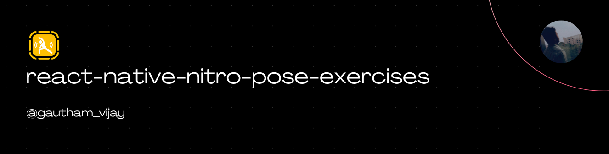
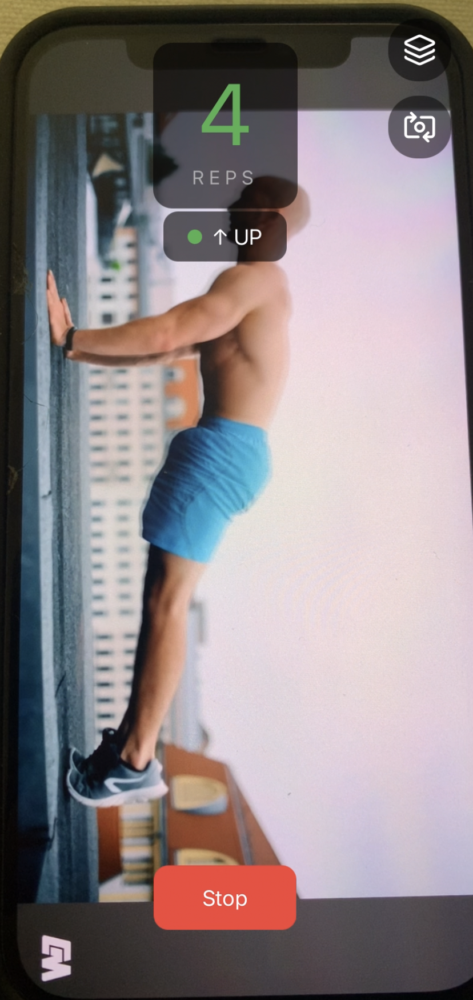
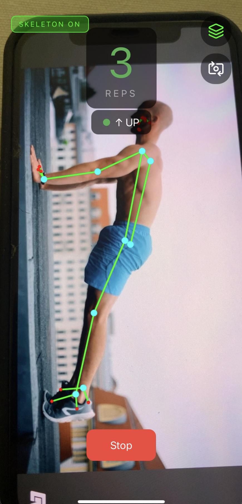

<a href="https://gauthamvijay.com">
  <picture>
    
  </picture>
</a>

# react-native-nitro-pose-exercises

A **React Native Nitro Module** for real-time, on-device exercise tracking using pose estimation. Built on **MediaPipe Pose Landmarker** and **VisionCamera v5**.

- 🏋️ **Rep Counting** — Automatic rep detection with configurable state machines
- 🧘 **Hold Tracking** — Duration and stability tracking for planks, yoga poses, and isometric holds
- 📐 **Form Validation** — Real-time form feedback with configurable angle-based rules
- 💀 **Skeleton Overlay** — Optional Skia-powered skeleton rendering over the camera feed
- ⚡ **Fully Native** — MediaPipe runs on-device via Nitro Modules, zero JS bridge overhead

---

> [!IMPORTANT]
>
> - Requires React Native **0.76+** with Nitro Modules and VisionCamera **v5**.
> - Must be tested on a **physical device** — camera + ML inference don't work on simulators.
> - MediaPipe Pose Landmarker model file (`pose_landmarker_lite.task`) must be bundled with the app.

---

## 📦 Installation

```bash
npm install react-native-nitro-pose-exercises react-native-nitro-modules
npm install react-native-vision-camera react-native-nitro-image
npm install react-native-vision-camera-worklets react-native-worklets
npm install react-native-reanimated
```

**For Skia skeleton overlay (optional):**

```bash
npm install @shopify/react-native-skia react-native-vision-camera-skia
```

```bash
cd ios && pod install
```

> [!NOTE]
> This package uses **MediaPipe Pose Landmarker** natively on both platforms.
> iOS uses `MediaPipeTasksVision` via CocoaPods.
> Android uses `com.google.mediapipe:tasks-vision` via Gradle.

---

## Demo

<table>
  <tr>
    <th align="center">🍏 iOS Normal Mode</th>
    <th align="center">🍏 iOS Skia Mode</th>
  </tr>
  <tr>
    <td align="center">
    
    </td>
    <td align="center">
    
    </td>
  </tr>
</table>

---

## 🧠 Overview

| Feature                  | Description                                                               |
| ------------------------ | ------------------------------------------------------------------------- |
| **Rep-Based Exercises**  | Cyclic state machine (UP → DOWN → UP = 1 rep). Push-ups, squats, curls.   |
| **Hold-Based Exercises** | Single target pose with duration tracking. Planks, wall sits, yoga poses. |
| **Flow-Based Exercises** | Ordered sequence of poses. Sun salutation, yoga flows. _(coming soon)_    |
| **Form Feedback**        | Angle-based rules with throttled real-time callbacks.                     |
| **Skeleton Overlay**     | 33-point body skeleton drawn over camera via Skia.                        |
| **Bilateral Tracking**   | Left and right side angles tracked independently.                         |

---

## 🔧 Setup

### Model File

Download the MediaPipe Pose Landmarker model:

```
https://storage.googleapis.com/mediapipe-models/pose_landmarker/pose_landmarker_lite/float16/latest/pose_landmarker_lite.task
```

**iOS:** Drag `pose_landmarker_lite.task` into your Xcode project (Copy items if needed, add to app target).

**Android:** Place at `android/app/src/main/assets/pose_landmarker_lite.task`

### Permissions

**iOS — `Info.plist`:**

```xml
<key>NSCameraUsageDescription</key>
<string>Camera is needed for pose detection during exercises</string>
<key>NSMicrophoneUsageDescription</key>
<string>Microphone access for audio during exercise sessions</string>
```

**Android — `AndroidManifest.xml`:**

```xml
<uses-permission android:name="android.permission.CAMERA" />
```

### Babel Config

```javascript
module.exports = {
  presets: ['module:@react-native/babel-preset'],
  plugins: [
    'react-native-worklets/plugin',
    'react-native-reanimated/plugin', // must be last
  ],
};
```

---

## ⚙️ Usage

### Basic — Normal Camera (No Skeleton)

```tsx
import { useEffect, useCallback, useState } from 'react';
import { StyleSheet, View, Text, TouchableOpacity } from 'react-native';
import {
  Camera,
  useCameraDevice,
  useCameraPermission,
  useFrameOutput,
  useAsyncRunner,
} from 'react-native-vision-camera';
import {
  nitroPoseExercises,
  PUSHUP_CONFIG,
  type RepData,
  type FormFeedback,
  type SessionResult,
} from 'react-native-nitro-pose-exercises';

export default function App() {
  const { hasPermission, requestPermission } = useCameraPermission();
  const device = useCameraDevice('back');
  const asyncRunner = useAsyncRunner();
  const [repCount, setRepCount] = useState(0);

  useEffect(() => {
    if (!hasPermission) requestPermission();
  }, [hasPermission]);

  // Initialize pose engine
  useEffect(() => {
    async function init() {
      await nitroPoseExercises.initialize('pose_landmarker_lite.task');
      nitroPoseExercises.loadExercise(PUSHUP_CONFIG);

      nitroPoseExercises.onRepComplete = (data: RepData) => {
        setRepCount(data.repNumber);
        console.log(`Rep ${data.repNumber} — form: ${data.formScore}`);
      };

      nitroPoseExercises.onFormFeedback = (feedback: FormFeedback) => {
        console.log(`Form: ${feedback.message}`);
      };

      nitroPoseExercises.onSessionComplete = (result: SessionResult) => {
        console.log(
          `Done! ${result.totalReps} reps, avg form: ${result.averageFormScore}`
        );
      };

      // Start: 10 target reps, 3 second countdown
      nitroPoseExercises.startSession(10, 3);
    }

    init();
    return () => {
      nitroPoseExercises.release();
    };
  }, []);

  // Frame processor
  const frameOutput = useFrameOutput({
    pixelFormat: 'rgb',
    onFrame(frame) {
      'worklet';
      const accepted = asyncRunner.runAsync(() => {
        'worklet';
        try {
          nitroPoseExercises.processFrame(frame);
        } finally {
          frame.dispose();
        }
      });
      if (!accepted) frame.dispose();
    },
  });

  if (!hasPermission || !device) return null;

  return (
    <View style={StyleSheet.absoluteFill}>
      <Camera
        style={StyleSheet.absoluteFill}
        device={device}
        isActive={true}
        outputs={[frameOutput]}
      />
      <Text style={styles.repText}>{repCount} REPS</Text>
    </View>
  );
}

const styles = StyleSheet.create({
  repText: {
    position: 'absolute',
    top: 100,
    alignSelf: 'center',
    fontSize: 48,
    fontFamily: 'System',
    color: '#4CAF50',
  },
});
```

### Skeleton Overlay — SkiaCamera

```tsx
import { SkiaCamera } from 'react-native-vision-camera-skia'
import { Skia } from '@shopify/react-native-skia'
import { nitroPoseExercises } from 'react-native-nitro-pose-exercises'

const SKELETON_CONNECTIONS: [number, number][] = [
  [11, 12], [11, 23], [12, 24], [23, 24],  // Torso
  [11, 13], [13, 15],                        // Left arm
  [12, 14], [14, 16],                        // Right arm
  [23, 25], [25, 27],                        // Left leg
  [24, 26], [26, 28],                        // Right leg
]

<SkiaCamera
  style={StyleSheet.absoluteFill}
  isActive={true}
  device="back"
  pixelFormat="rgb"
  onFrame={(frame, render) => {
    'worklet'
    try {
      nitroPoseExercises.processFrame(frame)
      const landmarks = nitroPoseExercises.landmarks

      render(({ frameTexture, canvas }) => {
        canvas.drawImage(frameTexture, 0, 0)

        if (landmarks && landmarks.length > 0) {
          const w = frame.width
          const h = frame.height

          // Draw bones
          const linePaint = Skia.Paint()
          linePaint.setColor(Skia.Color('#00FF00'))
          linePaint.setStrokeWidth(4)
          linePaint.setStyle(1)

          for (const [i, j] of SKELETON_CONNECTIONS) {
            if (i < landmarks.length && j < landmarks.length) {
              const a = landmarks[i]
              const b = landmarks[j]
              if (a.visibility > 0.5 && b.visibility > 0.5) {
                canvas.drawLine(a.x * w, a.y * h, b.x * w, b.y * h, linePaint)
              }
            }
          }

          // Draw joints
          const jointPaint = Skia.Paint()
          jointPaint.setColor(Skia.Color('#00FFFF'))
          jointPaint.setStyle(0)

          for (let idx = 0; idx < landmarks.length; idx++) {
            const lm = landmarks[idx]
            if (lm.visibility > 0.5) {
              canvas.drawCircle(lm.x * w, lm.y * h, 6, jointPaint)
            }
          }
        }
      })
    } finally {
      frame.dispose()
    }
  }}
/>
```

---

## 🧩 API Reference

### Lifecycle

```ts
// Initialize MediaPipe with model file path
initialize(modelPath: string): Promise<void>

// Clean up resources
release(): void
```

### Exercise Setup

```ts
// Load an exercise config (built-in or custom)
loadExercise(config: ExerciseConfig): void
```

### Session Control

```ts
startSession(targetReps: number, countdownSeconds: number): void
pauseSession(): void
resumeSession(): void
stopSession(): void
```

### Frame Processing

```ts
// Pass VisionCamera frame for pose detection — call from frame processor
processFrame(frame: Frame): void
```

### State (Readable)

```ts
readonly status: SessionStatus        // 'idle' | 'countdown' | 'active' | 'paused' | 'completed'
readonly currentPhase: ExercisePhase   // 'up' | 'down' | 'hold' | 'transition' | 'unknown'
readonly repCount: number
readonly landmarks: Landmark[]         // 33 body landmarks from MediaPipe
```

### Callbacks

```ts
onRepComplete: ((data: RepData) => void) | undefined
onPhaseChange: ((phase: ExercisePhase) => void) | undefined
onFormFeedback: ((feedback: FormFeedback) => void) | undefined
onHoldProgress: ((progress: HoldProgress) => void) | undefined
onPoseLost: (() => void) | undefined
onPoseRegained: (() => void) | undefined
onSessionComplete: ((result: SessionResult) => void) | undefined
```

---

### Callback Payloads

#### RepData

```ts
{
  repNumber: number       // Current rep count
  durationMs: number      // Time taken for this rep
  formScore: number       // 0-100 form quality score
  angles: AngleSnapshot[] // Joint angles at rep completion
}
```

#### FormFeedback

```ts
{
  ruleName: string; // e.g. 'hipSag'
  message: string; // e.g. 'Keep your hips up'
  severity: FormSeverity; // 'info' | 'warning' | 'error'
}
```

#### SessionResult

```ts
{
  totalReps: number
  totalDurationMs: number
  averageRepDurationMs: number
  averageFormScore: number
  formViolations: FormFeedback[]
  angleHistory: AngleSnapshot[]
}
```

---

## 🏋️ Built-In Exercise Configs

### Push-Up (`PUSHUP_CONFIG`)

| Parameter     | Value                                 |
| ------------- | ------------------------------------- |
| Type          | `rep`                                 |
| Primary Angle | Left elbow (shoulder → elbow → wrist) |
| UP Phase      | Elbow angle 140°–180°                 |
| DOWN Phase    | Elbow angle 30°–110°                  |
| Rep Sequence  | UP → DOWN → UP                        |
| Form Rules    | Hip sag detection, hip pike detection |

### Custom Exercise Config

```ts
import type { ExerciseConfig } from 'react-native-nitro-pose-exercises';

const SQUAT_CONFIG: ExerciseConfig = {
  name: 'Squat',
  type: 'rep',
  angles: [
    { name: 'leftKnee', landmarkA: 23, landmarkB: 25, landmarkC: 27 },
    { name: 'rightKnee', landmarkA: 24, landmarkB: 26, landmarkC: 28 },
  ],
  phases: [
    { phase: 'up', angleName: 'leftKnee', minAngle: 160, maxAngle: 180 },
    { phase: 'down', angleName: 'leftKnee', minAngle: 50, maxAngle: 110 },
  ],
  repSequence: ['up', 'down', 'up'],
  formRules: [
    {
      name: 'kneesCaving',
      message: 'Push your knees out over your toes',
      severity: 'warning',
      angleName: 'leftKnee',
      minAngle: 50,
      maxAngle: 180,
    },
  ],
  holdDurationMs: 0,
};
```

---

## 📐 MediaPipe Landmark Index Reference

| Index | Landmark       | Index | Landmark    |
| ----- | -------------- | ----- | ----------- |
| 0     | Nose           | 16    | Right wrist |
| 11    | Left shoulder  | 23    | Left hip    |
| 12    | Right shoulder | 24    | Right hip   |
| 13    | Left elbow     | 25    | Left knee   |
| 14    | Right elbow    | 26    | Right knee  |
| 15    | Left wrist     | 27    | Left ankle  |

Full 33-point reference: [MediaPipe Pose Landmarks](https://ai.google.dev/edge/mediapipe/solutions/vision/pose_landmarker#pose_landmarker_model)

---

## 📏 Camera Angle Guide

For best results, the camera should see the exerciser from a **side profile**:

| ✅ Good                            | ❌ Bad                   |
| ---------------------------------- | ------------------------ |
| Side view, full body visible       | Front-facing view        |
| Phone at waist height, 6-8 ft away | Ground-level angle       |
| Well-lit environment               | Heavy glare or backlight |

---

## 🧩 Supported Platforms

| Platform             | Status           | Notes                             |
| -------------------- | ---------------- | --------------------------------- |
| **iOS**              | ✅ Supported     | Requires physical device, iOS 14+ |
| **Android**          | ✅ Supported     | Min SDK 24 (Android 7.0)          |
| **iOS Simulator**    | ❌ Not supported | No camera access                  |
| **Android Emulator** | ❌ Not supported | No real camera feed               |

---

## 📊 App Size Impact

| Component                    | Size          |
| ---------------------------- | ------------- |
| Pose model (Lite)            | ~3 MB         |
| MediaPipe SDK (per platform) | ~8–12 MB      |
| Nitro module code            | ~200 KB       |
| **Total new addition**       | **~11–15 MB** |

---

## 🤝 Contributing

PRs welcome!

- [Development Workflow](CONTRIBUTING.md#development-workflow)
- [Sending a PR](CONTRIBUTING.md#sending-a-pull-request)
- [Code of Conduct](CODE_OF_CONDUCT.md)

---

## 🪪 License

MIT © [**Gautham Vijayan**](https://gauthamvijay.com)

---

Made with ❤️ and [**Nitro Modules**](https://nitro.margelo.com) + [**VisionCamera**](https://visioncamera.margelo.com) + [**MediaPipe**](https://ai.google.dev/edge/mediapipe)
