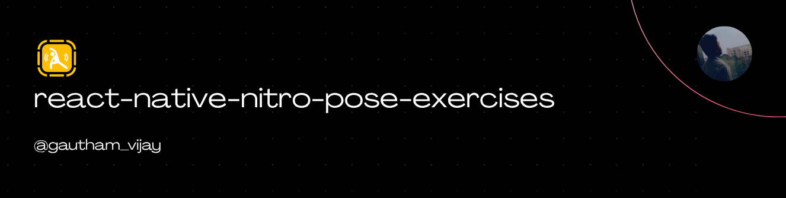

<a href="https://gauthamvijay.com">
  <picture>
    
  </picture>
</a>

# react-native-nitro-pose-exercises

A **React Native Nitro Module** for real-time, on-device exercise tracking using pose estimation. Uses **OS-native pose detection** — Apple Vision on iOS and Google ML Kit on Android — with **VisionCamera v5**.

* 🏋️ **38 Built-In Exercises** — Push-ups, squats, deadlifts, yoga poses, and more
* 🔄 **Rep Counting** — Automatic rep detection with configurable state machines
* 🧘 **Hold Tracking** — Duration and stability tracking for planks, yoga poses, and isometric holds
* 📐 **Form Validation** — Real-time form feedback with angle-based rules
* 🚦 **Posture Gating** — Refuses to count reps unless the user is in valid posture; "Get in position" feedback before sessions start
* 💀 **Skeleton Overlay** — Skia-powered skeleton with glow effects and live angle badges
* ⚡ **Fully Native** — OS-level pose detection via Nitro Modules, zero JS bridge overhead
* 📦 **Zero Model Bundling** — No ML model files to download or ship with your app
* 🪶 **~200 KB** — Virtually zero app size impact

---

> [!IMPORTANT]
>
> * Requires React Native **0.76+** with Nitro Modules and VisionCamera **v5**.
> * Must be tested on a **physical device** — camera + ML inference don't work on simulators.
> * iOS requires **iOS 14+** (Vision body pose API). Android requires **API 23+** (ML Kit).

---

## 📦 Installation

```bash
npm install react-native-nitro-pose-exercises react-native-nitro-modules
npm install react-native-vision-camera react-native-nitro-image
npm install react-native-vision-camera-worklets react-native-worklets
npm install react-native-reanimated
```

**For Skia skeleton overlay (optional):**

```bash
npm install @shopify/react-native-skia react-native-vision-camera-skia
```

```bash
cd ios && pod install
```

> [!NOTE]
> This package uses **OS-native pose detection** on both platforms.
> iOS uses Apple's **Vision framework** (`VNDetectHumanBodyPoseRequest`) — built into iOS, no extra dependencies.
> Android uses **Google ML Kit Pose Detection** (`com.google.mlkit:pose-detection:18.0.0-beta5`) — model auto-managed via Play Services.
> **No model files to bundle, no extra downloads, no color format conversions.**

---

## Demo

<table>
  <tr>
    <th align="center">📸 Normal Mode</th>
    <th align="center">💀 Skeleton + Angle Overlay</th>
  </tr>
  <tr>
    <td align="center">
      
    </td>
    <td align="center">
      
    </td>
  </tr>
</table>

---

## 🧠 Overview

| Feature | Description |
| --- | --- |
| **Rep-Based Exercises** | Cyclic state machine (UP → DOWN → UP = 1 rep). Push-ups, squats, curls, and more. |
| **Hold-Based Exercises** | Single target pose with duration + stability tracking. Planks, wall sits, yoga poses. |
| **Posture Gate** | Family-based posture validation. Refuses to start or count reps until user is in correct position (e.g. horizontal for pushups, upright for squats). |
| **Form Feedback** | Angle-based rules with throttled real-time callbacks. Bad form blocks rep counting. |
| **Skeleton Overlay** | Glow-effect bones, color-coded joints, and live angle badges drawn over camera via Skia. |
| **Bilateral Tracking** | Left and right side angles tracked independently. |
| **Fatigue Guard** | Minimum 800ms per rep prevents false counts. Form score gate rejects bad reps. |

---

## 🔧 Setup

### No Model File Needed

Unlike MediaPipe-based solutions, this library uses OS-native APIs. There is **no model file to download or bundle**.

* **iOS:** Apple Vision is a system framework — already on every iPhone running iOS 14+.
* **Android:** ML Kit manages its own model via Google Play Services — downloads and updates automatically.

### Permissions

**iOS — `Info.plist`:**

```xml
<key>NSCameraUsageDescription</key>
<string>Camera is needed for pose detection during exercises</string>
<key>NSMicrophoneUsageDescription</key>
<string>Microphone access for audio during exercise sessions</string>
```

**Android — `AndroidManifest.xml`:**

```xml
<uses-permission android:name="android.permission.CAMERA" />
```

### Babel Config

```javascript
module.exports = {
  presets: ['module:@react-native/babel-preset'],
  plugins: [
    'react-native-worklets/plugin',
    'react-native-reanimated/plugin', // must be last
  ],
};
```

### Podspec (for library authors)

```ruby
s.frameworks = ['Vision', 'AVFoundation']
```

No CocoaPods dependencies required — Vision is built into iOS.

### Android Gradle (for library authors)

```groovy
dependencies {
    implementation 'com.google.mlkit:pose-detection:18.0.0-beta5'
}
```

---

## ⚙️ Usage

### Basic — Normal Camera (No Skeleton)

```tsx
import { useEffect, useState } from 'react';
import { StyleSheet, View, Text } from 'react-native';
import {
  Camera,
  useCameraDevice,
  useCameraPermission,
  useFrameOutput,
  useAsyncRunner,
} from 'react-native-vision-camera';
import {
  nitroPoseExercises,
  PUSHUP_CONFIG,
  type RepData,
  type SessionResult,
} from 'react-native-nitro-pose-exercises';

export default function App() {
  const { hasPermission, requestPermission } = useCameraPermission();
  const device = useCameraDevice('back');
  const asyncRunner = useAsyncRunner();
  const [repCount, setRepCount] = useState(0);

  useEffect(() => {
    if (!hasPermission) requestPermission();
  }, [hasPermission]);

  useEffect(() => {
    async function init() {
      await nitroPoseExercises.initialize('');
      nitroPoseExercises.loadExercise(PUSHUP_CONFIG);

      nitroPoseExercises.onRepComplete = (data: RepData) => {
        setRepCount(data.repNumber);
      };

      nitroPoseExercises.onSessionComplete = (result: SessionResult) => {
        console.log(`Done! ${result.totalReps} reps, form: ${result.averageFormScore}`);
      };

      nitroPoseExercises.startSession(10, 3);
    }

    init();
    return () => { nitroPoseExercises.release(); };
  }, []);

  const frameOutput = useFrameOutput({
    pixelFormat: 'rgb',
    onFrame(frame) {
      'worklet';
      const accepted = asyncRunner.runAsync(() => {
        'worklet';
        try {
          nitroPoseExercises.processFrame(frame);
        } finally {
          frame.dispose();
        }
      });
      if (!accepted) frame.dispose();
    },
  });

  if (!hasPermission || !device) return null;

  return (
    <View style={StyleSheet.absoluteFill}>
      <Camera
        style={StyleSheet.absoluteFill}
        device={device}
        isActive={true}
        outputs={[frameOutput]}
      />
      <Text style={styles.repText}>{repCount} REPS</Text>
    </View>
  );
}

const styles = StyleSheet.create({
  repText: {
    position: 'absolute',
    top: 100,
    alignSelf: 'center',
    fontSize: 48,
    fontFamily: 'System',
    color: '#4CAF50',
  },
});
```

---

## 🧩 API Reference

### Lifecycle

```ts
// Initialize the pose engine (modelPath is ignored — OS-native, no model file needed)
initialize(modelPath: string): Promise<void>

// Clean up resources
release(): void
```

### Exercise Setup

```ts
loadExercise(config: ExerciseConfig): void
```

### Session Control

```ts
startSession(targetReps: number, countdownSeconds: number): void
pauseSession(): void
resumeSession(): void
stopSession(): void
// Returns true if the user is currently in valid posture for the loaded exercise.
// Poll this before starting a session, e.g. show "Get in position" until ready.
isReady(): boolean
```

### Frame Processing

```ts
// Call from VisionCamera frame processor worklet
processFrame(frame: Frame): void
```

### State (Readable)

```ts
readonly status: SessionStatus        // 'idle' | 'countdown' | 'active' | 'paused' | 'completed'
readonly currentPhase: ExercisePhase   // 'up' | 'down' | 'hold' | 'transition' | 'unknown'
readonly repCount: number
readonly landmarks: Landmark[]         // Body landmarks mapped to MediaPipe indices
```

### Callbacks

```ts
onRepComplete: ((data: RepData) => void) | undefined
onPhaseChange: ((phase: ExercisePhase) => void) | undefined
onFormFeedback: ((feedback: FormFeedback) => void) | undefined
onHoldProgress: ((progress: HoldProgress) => void) | undefined
onPoseLost: (() => void) | undefined
onPoseRegained: (() => void) | undefined
onPostureLost: (() => void) | undefined        
onPostureRegained: (() => void) | undefined
onSessionComplete: ((result: SessionResult) => void) | undefined
```

### Callback Payloads

#### RepData

```ts
{
  repNumber: number
  durationMs: number
  formScore: number        // 0-100
  angles: AngleSnapshot[]  // all tracked angles at rep completion
}
```

#### FormFeedback

```ts
{
  ruleName: string
  message: string
  severity: FormSeverity   // 'info' | 'warning' | 'error'
}
```

#### SessionResult

```ts
{
  totalReps: number
  totalDurationMs: number
  averageRepDurationMs: number
  averageFormScore: number
  formViolations: FormFeedback[]
  angleHistory: AngleSnapshot[]
}
```
---

## 🚦 Posture Gating

Each exercise config declares a **posture family** that defines what body position is required before reps are counted. This prevents false counts — e.g. waving your arm while standing won't count as a push-up.

### Posture Families

| Family | Description | Used For |
| --- | --- | --- |
| `horizontalProne` | Body horizontal, face down. Shoulders, hips, ankles in a horizontal band. | Push-ups, planks, cobra, mountain climbers |
| `standingUpright` | Standing, shoulders above hips above knees. | Squats, lunges, curls, presses, most yoga poses |
| `seated` | Hips near knees, shoulders above hips. | Boat pose, seated yoga, child's pose |
| `supine` | Body horizontal, face up. | Sit-ups, glute bridge, leg raises |
| `sidePlank` | Body horizontal, rotated to one side. | Side plank, side leg raises |
| `inverted` | Hips higher than shoulders and ankles. | Downward dog, handstand |
| `none` | No posture gating. | Custom or unconstrained exercises |

### Flow

loadExercise(config)  →  poll isReady()  →  user gets in position  →
isReady() returns true  →  startSession()  →  reps counted normally
↓
if posture breaks mid-session
→ onPostureLost fires
→ phase detection pauses
→ in-progress rep discarded
↓
user re-enters position
→ onPostureRegained fires
→ counting resumes

### Example: Wait for Position Before Starting

```tsx
const [isInPosition, setIsInPosition] = useState(false);

useEffect(() => {
// Wait for the user to get into position before starting
const checkInterval = setInterval(() => {
  if (nitroPoseExercises.isReady()) {
    clearInterval(checkInterval);
    nitroPoseExercises.startSession(10, 3);
  }
}, 300);
  return () => clearInterval(interval);
}, []);

useEffect(() => {
  nitroPoseExercises.onPostureLost = () => {
    setMessage('Get back into position');
  };
  nitroPoseExercises.onPostureRegained = () => {
    setMessage('');
  };
}, []);

return (
  <>
    {!isInPosition && <Text>Get into push-up position</Text>}
    {isInPosition && <Text>Hold still — starting...</Text>}
  </>
);
```

### Tuning

Posture gates use a **10-frame hysteresis** (about 1 second at 30fps with frame throttling) — single-frame failures don't pause the session. This prevents flicker from momentary occlusion or visibility drops.

---

## 🏋️ All 38 Built-In Exercise Configs

### Rep-Based: Strength (15 exercises)

| Config | Exercise | Primary Angle | Camera View |
| --- | --- | --- | --- |
| `PUSHUP_CONFIG` | Push-Up | Elbow 140°–180° / 30°–110° | Side |
| `PULL_UP_CONFIG` | Pull-Up | Elbow 150°–180° / 40°–90° | Side |
| `SQUAT_CONFIG` | Squat | Knee 155°–180° / 50°–105° | Side |
| `SUMO_SQUAT_CONFIG` | Sumo Squat | Knee 155°–180° / 60°–110° | Front |
| `BICEP_CURL_CONFIG` | Bicep Curl | Elbow 150°–180° / 25°–70° | Side |
| `SHOULDER_PRESS_CONFIG` | Shoulder Press | Elbow 155°–180° / 60°–100° | Side |
| `LUNGE_CONFIG` | Lunge | Front knee 155°–180° / 70°–110° | Side |
| `SIDE_LUNGE_CONFIG` | Side Lunge | Bent knee 155°–180° / 70°–110° | Front |
| `TRICEP_DIP_CONFIG` | Tricep Dip | Elbow 150°–180° / 60°–100° | Side |
| `DEADLIFT_CONFIG` | Deadlift | Hip 160°–180° / 60°–120° | Side |
| `LATERAL_RAISE_CONFIG` | Lateral Raise | Shoulder abduction 5°–30° / 75°–110° | Front |
| `FRONT_RAISE_CONFIG` | Front Raise | Shoulder flexion 0°–25° / 75°–110° | Side |
| `CALF_RAISE_CONFIG` | Calf Raise | Ankle 70°–95° / 110°–150° | Side |
| `OVERARM_REACH_CONFIG` | Overarm Reach | Shoulder abduction 0°–30° / 155°–180° | Front |
| `HIP_ABDUCTION_CONFIG` | Hip Abduction | Leg spread 0°–15° / 30°–60° | Front |

### Rep-Based: Core (6 exercises)

| Config | Exercise | Primary Angle | Camera View |
| --- | --- | --- | --- |
| `SITUP_CONFIG` | Sit-Up | Hip 130°–180° / 40°–90° | Side |
| `LEG_RAISE_CONFIG` | Leg Raise | Hip 150°–180° / 60°–110° | Side |
| `V_UP_CONFIG` | V-Up | Hip fold 150°–180° / 30°–80° | Side |
| `GLUTE_BRIDGE_CONFIG` | Glute Bridge | Hip extension 80°–120° / 155°–180° | Side |
| `COBRA_WINGS_CONFIG` | Cobra Wings | Hip extension 160°–180° / 120°–155° | Side |
| `KNEE_RAISE_CONFIG` | Knee Raise | Hip 155°–180° / 60°–110° | Side |

### Hold-Based: Strength (3 exercises)

| Config | Exercise | Hold Angle | Default Duration |
| --- | --- | --- | --- |
| `PLANK_CONFIG` | Plank | Hip 155°–180° | 60s |
| `SIDE_PLANK_CONFIG` | Side Plank | Hip lateral 155°–180° | 30s |
| `WALL_SIT_CONFIG` | Wall Sit | Knee 80°–110° | 45s |

### Hold-Based: Yoga (14 exercises)

| Config | Exercise | Hold Angle | Default Duration |
| --- | --- | --- | --- |
| `MOUNTAIN_POSE_CONFIG` | Mountain Pose (Tadasana) | Knee 170°–180° | 30s |
| `TREE_POSE_CONFIG` | Tree Pose (Vrksasana) | Standing leg 165°–180° | 30s |
| `CHAIR_POSE_CONFIG` | Chair Pose (Utkatasana) | Knee 90°–130° | 30s |
| `WARRIOR_I_CONFIG` | Warrior I (Virabhadrasana I) | Front knee 80°–110° | 30s |
| `WARRIOR_II_CONFIG` | Warrior II (Virabhadrasana II) | Front knee 80°–110° | 30s |
| `WARRIOR_III_CONFIG` | Warrior III (Virabhadrasana III) | Hip hinge 70°–110° | 30s |
| `REVERSE_WARRIOR_CONFIG` | Reverse Warrior | Front knee 80°–110° | 30s |
| `DOWNWARD_DOG_CONFIG` | Downward Dog (Adho Mukha Svanasana) | Hip 55°–100° | 30s |
| `COBRA_POSE_CONFIG` | Cobra Pose (Bhujangasana) | Hip extension 120°–170° | 30s |
| `TRIANGLE_POSE_CONFIG` | Triangle Pose (Trikonasana) | Front leg 160°–180° | 30s |
| `EXTENDED_SIDE_ANGLE_CONFIG` | Extended Side Angle (Utthita Parsvakonasana) | Front knee 80°–110° | 30s |
| `BRIDGE_POSE_CONFIG` | Bridge Pose (Setu Bandhasana) | Knee 80°–110° | 30s |
| `BOAT_POSE_CONFIG` | Boat Pose (Navasana) | Hip flexion 60°–110° | 30s |
| `CAMEL_POSE_CONFIG` | Camel Pose (Ustrasana) | Hip extension 120°–165° | 30s |
| `CHILDS_POSE_CONFIG` | Child's Pose (Balasana) | Hip fold 30°–80° | 60s |
| `BOW_POSE_CONFIG` | Bow Pose (Dhanurasana) | Knee 50°–100° | 30s |
| `FISH_POSE_CONFIG` | Fish Pose (Matsyasana) | Chest open 130°–170° | 30s |

### Custom Exercise Config

```ts
import type { ExerciseConfig } from 'react-native-nitro-pose-exercises';

const MY_EXERCISE: ExerciseConfig = {
  name: 'Custom Exercise',
  type: 'rep',  // 'rep' | 'hold'
  postureFamily: 'standingUpright',  // ← required: see table above
  angles: [
    { name: 'myAngle', landmarkA: 11, landmarkB: 13, landmarkC: 15 },
  ],
  phases: [
    { phase: 'up', angleName: 'myAngle', minAngle: 150, maxAngle: 180 },
    { phase: 'down', angleName: 'myAngle', minAngle: 30, maxAngle: 100 },
  ],
  repSequence: ['up', 'down', 'up'],
  formRules: [],
  holdDurationMs: 0,
};
```

---

## 📐 Landmark Index Reference

Landmarks are mapped to MediaPipe-compatible indices on both platforms. iOS Vision provides 19 joints (all exercise-critical joints covered), Android ML Kit provides the full 33.

| Index | Landmark | Index | Landmark |
| --- | --- | --- | --- |
| 0 | Nose | 16 | Right wrist |
| 11 | Left shoulder | 23 | Left hip |
| 12 | Right shoulder | 24 | Right hip |
| 13 | Left elbow | 25 | Left knee |
| 14 | Right elbow | 26 | Right knee |
| 15 | Left wrist | 27 | Left ankle |

**iOS note:** Vision provides 19 joints. Indices not available (face 1-10, hands 17-22, feet 29-32) are filled with `visibility: 0`.

**Android note:** ML Kit provides all 33 landmarks matching MediaPipe indices exactly.

---

## 📏 Camera Angle Guide

| ✅ Good | ❌ Bad |
| --- | --- |
| Side view, full body visible | Front-facing view |
| Phone at waist height, 6-8 ft away | Ground-level angle |
| Well-lit environment | Heavy glare or backlight |

Each exercise config includes a `cameraAngle` recommendation (`'side'` or `'front'`). Side view works for most exercises. Front view is needed for lateral raises, sumo squats, warrior II, and hip abductions.

---

## 🏗️ Architecture — OS-Native vs MediaPipe

| | OS-Native (current) | MediaPipe (previous) |
| --- | --- | --- |
| **iOS** | Apple Vision framework (built-in) | MediaPipeTasksVision (CocoaPod) |
| **Android** | Google ML Kit (Play Services) | com.google.mediapipe:tasks-vision |
| **Model file** | None needed | ~3 MB bundled `.task` file |
| **Color conversion** | None — takes CVPixelBuffer/InputImage directly | BGRA required (iOS), NV21→RGB (Android) |
| **App size impact** | ~200 KB (Nitro module code only) | ~11-15 MB (SDK + model) |
| **Updates** | OS/Play Services updates | Manual model file replacement |

---

## 🛡️ Safety Features

| Feature | Description |
| --- | --- |
| **Min rep duration** | 800ms minimum per rep — prevents false counts from sensor noise |
| **Form score gate** | Reps with form score below 30/100 are rejected and not counted |
| **Feedback throttle** | Same form warning fires max once every 5 seconds to avoid UI spam |
| **Pose lost detection** | `onPoseLost` / `onPoseRegained` callbacks when user exits/enters frame |
| **Frame throttle** | Processes every 3rd frame to reduce CPU load without losing accuracy |
| **Visibility filter** | Landmarks with confidence below 0.3 are excluded from angle calculations |
| **Posture entry gate** | Sessions don't start counting until `isReady()` returns true |
| **Posture hysteresis** | 10 consecutive failed frames required to fire `onPostureLost` — prevents flicker |

---

## 🧩 Supported Platforms

| Platform | Status | Notes |
| --- | --- | --- |
| **iOS** | ✅ Supported | Physical device, iOS 14+ (Vision body pose) |
| **Android** | ✅ Supported | API 23+, Google Play Services required |
| **iOS Simulator** | ❌ Not supported | No camera access |
| **Android Emulator** | ❌ Not supported | No real camera feed |

---

## 📊 App Size Impact

| Component | Size |
| --- | --- |
| Nitro module code (Swift + Kotlin) | ~200 KB |
| ML Kit (Android, via Play Services) | ~0 KB (managed externally) |
| Vision framework (iOS, built-in) | ~0 KB (system framework) |
| **Total new addition** | **~200 KB** |

---

## 🤝 Contributing

PRs welcome! Adding a new exercise is as simple as creating a config file — no native code changes needed.

* [Development Workflow](CONTRIBUTING.md#development-workflow)
* [Sending a PR](CONTRIBUTING.md#sending-a-pull-request)
* [Code of Conduct](CODE_OF_CONDUCT.md)

---

## 🪪 License

MIT © [**Gautham Vijayan**](https://gauthamvijay.com)

---

Made with ❤️ and [**Nitro Modules**](https://nitro.margelo.com) + [**VisionCamera**](https://visioncamera.margelo.com) + [**Apple Vision**](https://developer.apple.com/documentation/vision) + [**ML Kit**](https://developers.google.com/ml-kit/vision/pose-detection)